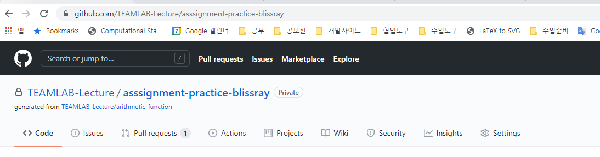
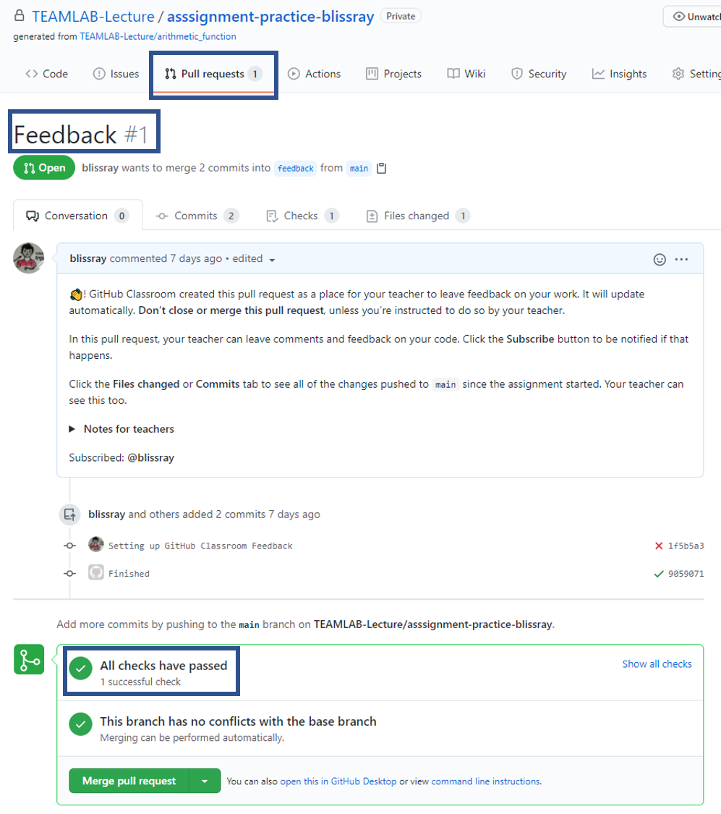

# Homework - Basic Math

## 개요

본 과제에서는 기초적인 list와 변수 사용법을 학습합니다. 본 과제에서 풀어야 할 문제는 아래 4가지가 있습니다.

## 숙제 다운로드 방법

1. 아래링크를 클릭하여 숙제 github repository를 복사함
   [https://classroom.github.com/a/xBb9wO1F](https://classroom.github.com/a/xBb9wO1F)
2. 아래 코드를 사용하여 숙제 코드 github repository를 자신의 컴퓨터로 클론함
    ```
    git clone <레포지토리 URL>
    ```
    
3. 해당 폴더로 이동하여 자신의 코드를 수정함

## 함수 리스트

- get_greatest

```
"""
주어진 리스트에서 가장 큰 숫자를 반환함
    Parameters:
        number_list (list): integer로 값으로만 구성된 list
        ex - [10, 33, 22, 99, 33]

    Returns:
        greatest_number (int): parameter number_list 중 가장 큰 값

    Examples:
        >>> number_list = [39, 54, 32, 11, 99]
        >>> import basic_math as bm
        >>> bm.get_greatest(number_list)
        99
"""
```

- get_smallest
```
주어진 리스트에서 제일 작은 숫자를 반환함

    Parameters:
        number_list (list): integer로 값으로만 구성된 list
        ex - [10, 33, 22, 99, 33]

    Returns:
        smallest_number (int): parameter number_list 중 가장 작은 값

    Examples:
        >>> number_list = [39, 54, 32, 11, 99]
        >>> import basic_math as bm
        >>> bm.get_smallest(number_list)
        11
```

- get_mean
```
주어진 리스트 숫자들의 평균을 구함.

    Parameters:
        number_list (list): integer로 값으로만 구성된 list
        ex - [10, 33, 22, 99, 33]

    Returns:
        mean (int): parameter number_list 숫자들의 평균

    Examples:
        >>> number_list = [39, 54, 32, 11, 99]
        >>> import basic_math as bm
        >>> bm.get_mean(number_list)
        47
```

- get_median
```
주어진 리스트 숫자들의 중간값을 구함.

    Parameters:
        number_list (list): integer로 값으로만 구성된 list
        ex - [10, 33, 22, 99, 33]

    Returns:
        median (int): parameter number_list 숫자들의 중간값

    Examples:
        >>> number_list = [39, 54, 32, 11, 99]
        >>> import basic_math as bm
        >>> bm.get_median(number_list)
        39
        >>> number_list2 = [39, 54, 32, 11, 99, 5]
        >>> bm.get_median(number_list2)
        35.5
```

## 제출방법
1. 숙제 코드를 수정한 후 commit 수행
   ```
   git add *.py
   git commit -m "Update my code"
   ```
2. 자신의 code repository에 코드를 push함
    ```
    git push origin main
    ```
3. 자신의 코드가 all pass를 받았는지 확인함
    